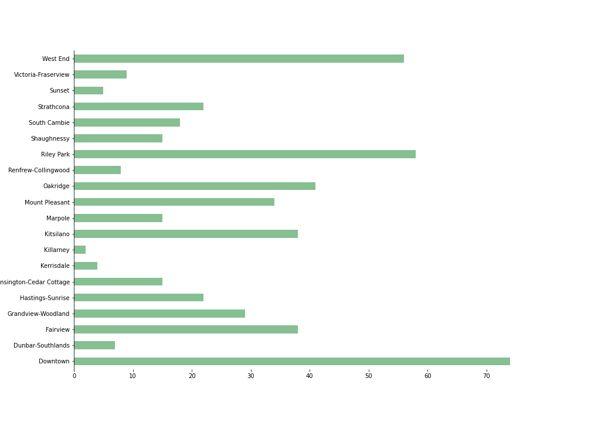

Author: Haoyu Su  
Updated: August 17, 2020

# Introduction

Vancouver, a bustling west coat seaport, is full of business
opportunities. Millions of tourists come here every year to enjoy the
beautiful scenery. So there are always unlimited possibilities for those
who want to open their own restraurant. The biggest challenge they are
facing is which location is the best that has relatively small
competition, large passenger flow and good surrounding resources. To
solve this question, the project is going to segment neighborhoods in
Vancouver using a popular clustering technique, trying to figure out a
solution for potential restaurant investors.

# Data

The neighborhood data is scraped from
[Wekipedia](https://en.wikipedia.org/wiki/List_of_neighbourhoods_in_Vancouver)
and corresponding coordinates are obtained using
[geocoder](https://geocoder.readthedocs.io/), and all data of venues in
each neighborhoods is returned by [Foursquare
API](https://developer.foursquare.com/). There are 20 official
neighborhoods and 510 venues in Vancouver, which will be the main
research objects.

# Methods

Several techniques are applied for data acquisition, data proprocessing
and model development in Python.

## Data Acquisition

The list of official neighborhoods is found on
[Wekipedia](https://en.wikipedia.org/wiki/List_of_neighbourhoods_in_Vancouver)
which is scraped using BeautifulSoup and Requests packages with Python.
The corresponding coordinates of each neighborhoods are obtained using
[geocoder](https://geocoder.readthedocs.io/). All venure information is
returned by [Foursquare API](https://developer.foursquare.com/).

## Data Preprocessing

Venue Category, a categorical feature is transformed to numeric features
by using one-hot encoding. The frequency of each venue category in each
neighborhood is calculated to be used as key features in neighborhood
segementation. And the top 10 most common venues category are identified
for each neighborhood.

## Model Development

The unsupervised machine learning technique **Kmean** is used to cluster
similar neighborhoods. Elbow plot is used to find the optimal number of
clusters. Folium is used to visualize those resulting clusters on the
map.

# Result

Please refer to
[here](https://nbviewer.jupyter.org/github/clsu22/IBM-Capstone-Project/blob/master/src/Final-Project-Analysis.ipynb)
to see the whole analysis and interactive visualization.

## EDA

Figure 1 shows the number of venues in each neighborhood and Figure 2
shows the relative frequency of top 10 most common venues in each
neighborhood. There are the most number of vanues in Downtown while the
least number of venues Killarney.

Figure 1. The number of venues in each neighborhood

Figure 2. The frequency of top 10 venues in each neighborhood

## Clustering

Given the elbow plot shown in Figure 3, the kmeans will segement all
neighborhoods in 5 clusters. The result of clustering is shown in Table
1.

Figure 3. Elbow plot

| Cluster.Labels | Neighborhood             | 1st.Most.Common.Venue | 2nd.Most.Common.Venue  | 3rd.Most.Common.Venue | 4th.Most.Common.Venue | 5th.Most.Common.Venue        | 6th.Most.Common.Venue     | 7th.Most.Common.Venue         | 8th.Most.Common.Venue     | 9th.Most.Common.Venue | 10th.Most.Common.Venue |
| -------------: | :----------------------- | :-------------------- | :--------------------- | :-------------------- | :-------------------- | :--------------------------- | :------------------------ | :---------------------------- | :------------------------ | :-------------------- | :--------------------- |
|              0 | Sunset                   | Convenience Store     | Sandwich Place         | Gas Station           | Pizza Place           | Park                         | Yoga Studio               | Farmers Market                | Food & Drink Shop         | Flower Shop           | Fish Market            |
|              0 | Victoria-Fraserview      | Pet Store             | Park                   | Convenience Store     | Asian Restaurant      | Motorcycle Shop              | Noodle House              | Pizza Place                   | Middle Eastern Restaurant | Fish Market           | Food & Drink Shop      |
|              1 | Downtown                 | Hotel                 | Café                   | Seafood Restaurant    | Restaurant            | Coffee Shop                  | Steakhouse                | Taco Place                    | Clothing Store            | Theater               | Concert Hall           |
|              1 | South Cambie             | Bus Stop              | Chinese Restaurant     | Park                  | Dessert Shop          | Gym                          | Bubble Tea Shop           | Sushi Restaurant              | Gift Shop                 | Coffee Shop           | Malay Restaurant       |
|              1 | Shaughnessy              | Sushi Restaurant      | Coffee Shop            | Bank                  | Sporting Goods Shop   | Shopping Mall                | Vietnamese Restaurant     | Bubble Tea Shop               | Sandwich Place            | Grocery Store         | Greek Restaurant       |
|              1 | Riley Park               | Japanese Restaurant   | Restaurant             | Coffee Shop           | Café                  | Arts & Crafts Store          | Grocery Store             | Vegetarian / Vegan Restaurant | Furniture / Home Store    | Bookstore             | Pub                    |
|              1 | Renfrew-Collingwood      | Convenience Store     | Malay Restaurant       | Bus Stop              | Supermarket           | Sushi Restaurant             | Bookstore                 | Chinese Restaurant            | Pizza Place               | Ethiopian Restaurant  | Falafel Restaurant     |
|              1 | Oakridge                 | Jewelry Store         | Electronics Store      | Fast Food Restaurant  | Coffee Shop           | Sushi Restaurant             | Shoe Store                | Tea Room                      | Accessories Store         | Snack Place           | Food Court             |
|              1 | Marpole                  | Café                  | Restaurant             | Scenic Lookout        | Liquor Store          | Bus Stop                     | Night Market              | Shoe Store                    | Grocery Store             | Burger Joint          | Harbor / Marina        |
|              1 | Kensington-Cedar Cottage | Vietnamese Restaurant | Café                   | Indian Restaurant     | Sandwich Place        | Burger Joint                 | Supermarket               | Breakfast Spot                | Seafood Restaurant        | Church                | Grocery Store          |
|              1 | Hastings-Sunrise         | Bus Station           | Coffee Shop            | Soccer Field          | Bus Stop              | Theme Park Ride / Attraction | Sporting Goods Shop       | Chinese Restaurant            | Bridal Shop               | Sushi Restaurant      | Fast Food Restaurant   |
|              1 | Fairview                 | Breakfast Spot        | Furniture / Home Store | Park                  | Restaurant            | Japanese Restaurant          | Arts & Crafts Store       | Camera Store                  | Coffee Shop               | Spa                   | Pharmacy               |
|              1 | Dunbar-Southlands        | Bank                  | Mexican Restaurant     | Cosmetics Shop        | Indian Restaurant     | Café                         | Sushi Restaurant          | Yoga Studio                   | Food Court                | Food & Drink Shop     | Flower Shop            |
|              1 | Kitsilano                | Coffee Shop           | Park                   | Yoga Studio           | Bank                  | Café                         | Pizza Place               | Pub                           | Restaurant                | Chinese Restaurant    | Italian Restaurant     |
|              1 | West End                 | Ramen Restaurant      | Dessert Shop           | Coffee Shop           | Café                  | Grocery Store                | Japanese Restaurant       | Restaurant                    | Breakfast Spot            | Bubble Tea Shop       | Greek Restaurant       |
|              2 | Kerrisdale               | Park                  | Supermarket            | Spanish Restaurant    | Café                  | French Restaurant            | Food Court                | Food & Drink Shop             | Flower Shop               | Fish Market           | Fast Food Restaurant   |
|              3 | Mount Pleasant           | Brewery               | Bakery                 | Ice Cream Shop        | Coffee Shop           | Music Store                  | Middle Eastern Restaurant | Café                          | Movie Theater             | Shop & Service        | Chinese Restaurant     |
|              3 | Grandview-Woodland       | Brewery               | Coffee Shop            | Hotel                 | Liquor Store          | Deli / Bodega                | Pub                       | Electronics Store             | Fast Food Restaurant      | Nightclub             | Chinese Restaurant     |
|              3 | Strathcona               | Brewery               | Coffee Shop            | Ice Cream Shop        | Discount Store        | Hotel                        | Music Venue               | Sandwich Place                | Ethiopian Restaurant      | Grocery Store         | Building               |
|              4 | Killarney                | Pool                  | Coffee Shop            | Yoga Studio           | Farmers Market        | Food Truck                   | Food Court                | Food & Drink Shop             | Flower Shop               | Fish Market           | Fast Food Restaurant   |

Table 1. Neighborhood segmentation result

# Discussion

Neighborhoods in cluster 1 (purple) and cluster 2 (blue) are full of
different kinds of restraurants. Japanese and Chinese restaurants are
mostly located in cluster 1 while French Restaurants are mostly located
in cluster 2. Cluster 1 includes downtown vancouver with a high volume
of people flow and relative large competition while cluster 2 is a
little far from downtown but will have less rents. Other clusters have
less restaurant but cluster 3 has a lot of Café and Coffee shop which is
a good place to open dessert restaurants. Therefore if you have enough
money, I would recommand you to open restaurants in neighborhoods closer
to downtown in cluster 1 such a Downtown, South Cambie and Oakridge. But
if you don’t have enough money and want to have less stress of peer
competition, I would recommand you to open restaurants in neighborhoods
relatively from Downtown in cluster 1 or other neighborhoods in cluster
2 or cluster 3.

Figure 4. Neighborhood segmentation result

# Conclusion

This project applied the kmeans technique to successfully segement 20
neighborhoods into 5 clusters. Some useful suggestions on opening
restaurants are given based on the cluster result. More analysis can be
done using more information such as neighborhoods’ GDP and population.
